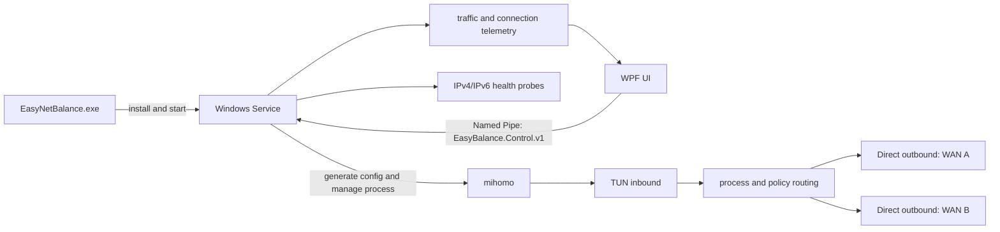

# EasyNetBalance

[简体中文](README.zh-CN.md)

EasyNetBalance is a Windows multi-WAN routing manager. It routes traffic from selected applications through specific network interfaces and moves new connections to a fallback interface when an uplink becomes unhealthy. mihomo provides the data plane; the EasyNetBalance Service generates its configuration, probes interfaces, manages failover, and exposes runtime telemetry.

Typical uses include:

- Pinning a browser, downloader, or other process to a chosen uplink.
- Sharing new connections across two WANs according to an actual byte-volume target.
- Failing over IPv4 and IPv6 independently.
- Inspecting per-uplink traffic, active connections, processes, destination IPs, actual egress, and predicted egress.

EasyNetBalance does not combine two links into one connection, and it does not migrate established TCP connections. The traffic ratio applies to new connections.

## Quick start

### Use a release package

Download the Windows x64 ZIP from [GitHub Releases](https://github.com/jung233/EasyNetBalance/releases), extract it, and run:

```text
EasyNetBalance.exe
```

This is the only user-facing entry point. On first launch it requests administrator privileges, installs the bundled Service and mihomo into protected directories, registers and starts the `EasyBalance` Windows Service, and opens the management UI. Later launches open the UI from the same EXE. Closing the UI does not stop routing.

The release package already contains the official mihomo Windows binary; users do not need to download a separate core. Each package includes `THIRD_PARTY_NOTICES.md`, `SING-BOX-SOURCE.txt`, the upstream license, and the corresponding source archive information. See [third-party notices](THIRD_PARTY_NOTICES.md).

### First configuration

1. Open **Interfaces**, keep the interfaces that may carry traffic, and disable unwanted virtual interfaces.
2. In **Failover / Policies**, create a policy and choose its primary and fallback interfaces.
3. For dual-WAN operation, enable load balancing and move the ratio slider. For example, `70% / 30%` is a target for the actual bytes forwarded by future connections.
4. In **Application rules**, add a rule by executable path or process name and assign a policy. A full executable path takes precedence over a matching process name.
5. Click **Enable routing**, then confirm the result in Dashboard, Interfaces, and Live monitor.

Changing the ratio does not restart mihomo or move established connections. When one uplink is unhealthy, new connections use the healthy uplink; after recovery, allocation gradually returns to the configured ratio.

## UI pages

- **Dashboard** — service, mihomo, policy, and interface overview.
- **Application rules** — process-to-policy mappings.
- **Interfaces** — interface details, IPv4/IPv6 health, gateways, latency, and probe times.
- **Failover / Policies** — primary/fallback behavior, auto-failback, and dual-WAN byte targets.
- **Live monitor** — per-uplink upload/download rates, totals, active connections, process, destination IP, actual egress, and predicted egress.
- **Logs** — Service, mihomo, and failover events.
- **Diagnostics** — generated-config validation, counters, and a downloadable diagnostic ZIP with optional IP redaction.

Telemetry combines Service sampling with data from the mihomo control API. Very short connections can fall between samples. If the core cannot provide reliable process or egress information, the UI shows `Unknown` rather than guessing.

## Architecture



| Component | Responsibility |
| --- | --- |
| `EasyNetBalance.exe` (UI) | Single-file entry point, first-run installation/update, and WPF management UI. It does not start mihomo directly. |
| `EasyBalance.Service` | Windows Service that persists settings, probes interfaces, generates configuration, manages the core, performs failover, and serves telemetry. |
| `mihomo` | TUN, DNS/routing rules, and actual network forwarding. |
| `EasyBalance.Shared` | Shared settings, policy, rule, and IPC DTO models. |
| Named Pipe | Local UI-to-Service control channel; requests and responses are one-line JSON messages. |

For every policy and address family, the Service generates a selector and writes `process_path` / `process_name` rules into the mihomo configuration. Interfaces are stored by their persistent Windows GUID; their current adapter name is resolved only while generating the configuration, so a renamed adapter keeps its policy identity.

Dual-WAN mode uses a loopback-only SOCKS5 allocation layer inside the Service. It measures upload and download bytes already forwarded by each uplink, chooses the side that needs to catch up for each new connection, and lets mihomo bind that connection to the matching physical interface. The control API and allocation layer listen only on `127.0.0.1` and use random credentials.

## Data and installation locations

| Location | Contents |
| --- | --- |
| `%ProgramData%\\EasyBalance\\settings.json` | Settings, policies, and application rules. |
| `%ProgramData%\\EasyBalance\\generated\\mihomo.json` | Current generated configuration; secrets and proxy passwords are redacted in diagnostics. |
| `%ProgramData%\\EasyBalance\\logs\\` | Service logs. |
| `%LocalAppData%\\EasyBalance\\logs\\ui-startup.log` | UI installation, update, and startup errors. |
| `%ProgramFiles%\\EasyBalance\\` | Protected Service and mihomo installation directory. |

To remove the service, use an elevated PowerShell:

```powershell
sc.exe stop EasyBalance
sc.exe delete EasyBalance
```

If mihomo reports that its installation directory can be replaced or written by ordinary users, keep the default SYSTEM/Administrators ownership and ACLs. Do not place the core under Downloads, the desktop, or another user-writable directory.

## Build from source

Development requires Windows 10/11 and the .NET 8 SDK. The release workflow builds on a Windows runner, bundles the official mihomo core into the single EXE, and creates a preview Release when `main` is updated.

```powershell
dotnet restore .\\EasyBalance.sln
dotnet build .\\EasyBalance.sln -c Release
```

For source debugging, start the Service and UI separately. The Service supports `--console`:

```powershell
.\\src\\EasyBalance.Service\\bin\\Release\\net8.0-windows\\EasyBalance.Service.exe --console
.\\src\\EasyBalance.UI\\bin\\Release\\net8.0-windows\\EasyBalance.UI.exe
```

A source checkout needs a compatible `mihomo.exe`. Put it at `core\\mihomo.exe` beside the Service executable, or configure an absolute path in a protected administrator-owned directory. The binary must support the TUN, routing, and Clash API features used by the project; the Service checks `mihomo version` before startup.

## UI and Service contract

When rebuilding or integrating a UI, follow [UI_SERVICE_CONTRACT.md](docs/UI_SERVICE_CONTRACT.md). It defines:

- Named Pipe name, request/response envelopes, and error handling;
- status, interface, rule, log, diagnostic, and connection-telemetry methods;
- the `SetTrafficRatio` slider contract;
- single-EXE installation/update behavior and sensitive-data handling.

The UI should poll connection telemetry about every two seconds and stop polling when the monitor page is left. After a write failure, show the Service error and reload status/logs so the UI does not display stale state.

## Troubleshooting

1. **Service unavailable** — launch the entry point as administrator and inspect the UI startup log and the Service logs.
2. **mihomo core faulted** — check the core path, installation ACLs, TUN driver, required capabilities, and the latest Service log.
3. **Invalid IP address** — check policy gateways, DNS servers, probe endpoints, and saved interface addresses separately for IPv4 and IPv6.
4. **No traffic or a routing loop** — verify that each direct outbound binds the current physical adapter. Temporarily disable `strict_route` while diagnosing VPN, Hyper-V, WSL, or Docker conflicts.
5. **Only one uplink is used** — ensure both interfaces are allowed and healthy for the required address family, and that the policy selects two different interfaces. The ratio affects new connections only.

EasyNetBalance does not provide seamless migration of existing connections, single-flow bandwidth aggregation, MPTCP, or packet-level multipath. TUN, DNS, IPv6, sleep/resume, and coexistence with other VPN software still need validation on the target Windows environment.

## License

EasyNetBalance is a separate control application. Release packages may include an unmodified mihomo Windows binary, which is distributed under GPL-3.0-or-later. If you redistribute a package containing mihomo, preserve its copyright and license notices and provide the corresponding source under the GPL terms. See [THIRD_PARTY_NOTICES.md](THIRD_PARTY_NOTICES.md) for attribution and source details.
