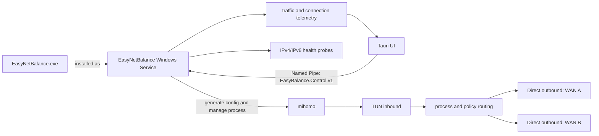

# EasyNetBalance

[简体中文](README.zh-CN.md)

EasyNetBalance is a Windows multi-WAN routing manager. It routes traffic from selected applications through specific network interfaces and moves new connections to a fallback interface when an uplink becomes unhealthy. mihomo provides the data plane; the EasyNetBalance Service generates its configuration, probes interfaces, manages failover, and exposes runtime telemetry.

Typical uses include:

- Pinning a browser, downloader, or other process to a chosen uplink.
- Sharing new connections across two WANs according to an actual byte-volume target.
- Failing over IPv4 and IPv6 independently.
- Inspecting per-uplink traffic, active connections, processes, destination IPs, actual egress, and predicted egress.

EasyNetBalance does not combine two links into one connection, and it does not migrate established TCP connections. The traffic ratio applies to new connections.

## Quick start

### Use a release package

Download and run the Windows x64 setup EXE from [GitHub Releases](https://github.com/jung233/EasyNetBalance/releases):

```text
EasyNetBalance-<version>-win-x64-setup.exe
```

The installer requests administrator privileges, installs EasyNetBalance under `<InstallRoot>`, and registers `EasyNetBalance.exe --service` as the automatic-start `EasyNetBalance` Windows Service. After installation, launch the installed EasyNetBalance app to open the management UI. The UI and service use the same executable; closing the UI does not stop routing.

`<InstallRoot>` is the directory selected in the installer. The core is located relative to the running executable; service data is located through Windows CommonApplicationData. No drive letter or absolute installation path is assumed.

`<InstallRoot>` is the directory selected in the installer. The core is located relative to the running executable; service data is located through Windows CommonApplicationData. No drive letter or absolute installation path is assumed.

The installer includes the patched Mihomo Windows core and license/provenance notices; users do not need to download a separate core. The release also publishes the matching Mihomo source archive, `THIRD_PARTY_NOTICES.md`, and SHA-256 checksums. See [third-party notices](THIRD_PARTY_NOTICES.md).

### First configuration

1. Open **Interfaces**, keep the interfaces that may carry traffic, and disable unwanted virtual interfaces.
2. In **Failover / Policies**, create a policy and choose its primary and fallback interfaces.
3. For dual-WAN operation, enable load balancing and move the ratio slider. For example, `70% / 30%` is a target for the actual bytes forwarded by future connections.
4. In **Application rules**, add a rule by executable path or process name and assign a policy. A full executable path takes precedence over a matching process name.
5. Click **Enable routing**, then confirm the result in Dashboard, Interfaces, and Live monitor.

Changing the ratio does not restart mihomo or move established connections. When one uplink is unhealthy, new connections use the healthy uplink; after recovery, allocation gradually returns to the configured ratio.

## UI pages

- **Dashboard** — service, mihomo, policy, and interface overview.
- **Application rules** — process-to-policy mappings.
- **Interfaces** — interface details, IPv4/IPv6 health, gateways, latency, and probe times.
- **Failover / Policies** — primary/fallback behavior, auto-failback, and dual-WAN byte targets.
- **Live monitor** — per-uplink upload/download rates, totals, active connections, process, destination IP, actual egress, and predicted egress.
- **Logs** — Service, mihomo, and failover events.
- **Diagnostics** — generated-config validation, counters, and a downloadable diagnostic ZIP with optional IP redaction.

Telemetry combines Service sampling with data from the mihomo control API. Very short connections can fall between samples. If the core cannot provide reliable process or egress information, the UI shows `Unknown` rather than guessing.

## Architecture



| Component | Responsibility |
| --- | --- |
| `EasyNetBalance.exe` | Tauri desktop UI by default; the same executable runs the Windows Service with `--service`. The service persists settings, probes interfaces, generates configuration, manages Mihomo, performs failover, and serves telemetry. |
| `mihomo.exe` | Bundled at `<InstallRoot>\resources\core\mihomo.exe`; handles TUN, DNS/routing rules, and network forwarding. |
| Named Pipe | Local UI-to-Service control channel; requests and responses are one-line JSON messages. |

For every policy and address family, the Service generates a selector and writes `process_path` / `process_name` rules into the mihomo configuration. Interfaces are stored by their persistent Windows GUID; their current adapter name is resolved only while generating the configuration, so a renamed adapter keeps its policy identity.

Dual-WAN mode uses a loopback-only SOCKS5 allocation layer inside the Service. It measures upload and download bytes already forwarded by each uplink, chooses the side that needs to catch up for each new connection, and lets mihomo bind that connection to the matching physical interface. The control API and allocation layer listen only on `127.0.0.1` and use random credentials.

## Data and installation locations

| Location | Contents |
| --- | --- |
| `%ProgramData%\EasyNetBalance\settings.json` | Settings, policies, and application rules. |
| `%ProgramData%\EasyNetBalance\mihomo\` | Mihomo working directory and generated `config.yaml`. |
| `<InstallRoot>\` | Protected application and service installation; Mihomo is bundled under `resources\core\mihomo.exe`. |

Uninstall EasyNetBalance from **Settings → Apps → Installed apps**. The uninstaller removes the service and application files while preserving `%ProgramData%\EasyNetBalance`; delete that data directory separately only if you also want to remove saved settings.

The service and data directories are protected from ordinary-user writes. Do not move the core under Downloads, the desktop, or another user-writable directory.

## Build from source

Development and release builds use Windows 10/11, Node.js 22, the stable Rust toolchain, and Go 1.26. The frontend and Tauri/Rust application are under `src/EasyBalance.UI`; the pinned Mihomo source is under `third_party/mihomo`. See [.github/workflows/release.yml](.github/workflows/release.yml) for the full build, license collection, and NSIS packaging sequence. The workflow builds Mihomo into `src/EasyBalance.UI/src-tauri/resources/core/mihomo.exe` before creating the installer.

## UI and Service contract

When rebuilding or integrating a UI, follow [UI_SERVICE_CONTRACT.md](docs/UI_SERVICE_CONTRACT.md). It defines:

- Named Pipe name, request/response envelopes, and error handling;
- status, interface, rule, log, diagnostic, and connection-telemetry methods;
- the `SetTrafficRatio` slider contract;
- shared UI/service executable, installation/update behavior, and sensitive-data handling.

The UI should poll connection telemetry about every two seconds and stop polling when the monitor page is left. After a write failure, show the Service error and reload status/logs so the UI does not display stale state.

## Troubleshooting

1. **Service unavailable** — check that the `EasyNetBalance` service is running in Windows Services, then refresh the UI.
2. **mihomo core faulted** — check `<InstallRoot>\resources\core\mihomo.exe`, the TUN driver, required capabilities, and the latest entries on the Logs page.
3. **Invalid IP address** — check policy gateways, DNS servers, probe endpoints, and saved interface addresses separately for IPv4 and IPv6.
4. **No traffic or a routing loop** — verify that each direct outbound binds the current physical adapter. Temporarily disable `strict_route` while diagnosing VPN, Hyper-V, WSL, or Docker conflicts.
5. **Only one uplink is used** — ensure both interfaces are allowed and healthy for the required address family, and that the policy selects two different interfaces. The ratio affects new connections only.

EasyNetBalance does not provide seamless migration of existing connections, single-flow bandwidth aggregation, MPTCP, or packet-level multipath. TUN, DNS, IPv6, sleep/resume, and coexistence with other VPN software still need validation on the target Windows environment.

## License

EasyNetBalance is a separate control application. Release packages include a Mihomo core with the project's weighted-bytes changes; Mihomo is distributed under GPL-3.0-or-later. If you redistribute a package containing Mihomo, preserve its copyright and license notices and provide the corresponding source under the GPL terms. See [THIRD_PARTY_NOTICES.md](THIRD_PARTY_NOTICES.md) and the matching source archive published with each release.
