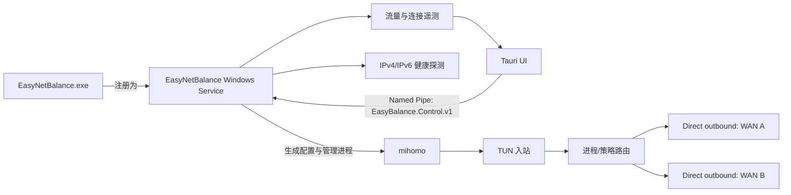

# EasyNetBalance

[English](README.md)

EasyNetBalance 是一个面向 Windows 的多 WAN 网络路由管理器。它把不同应用的流量按规则送到指定网卡，并在网卡故障时把后续新连接切换到备用出口。项目把 mihomo 作为数据平面，由 EasyNetBalance Service 负责配置、健康检查、故障转移和运行状态采集。

它适合需要同时使用有线、Wi-Fi、蜂窝网络或 VPN 虚拟网卡的场景，例如：

- 让浏览器、下载器或指定程序固定走某个出口；
- 两个 WAN 按实际流量字节比例分担新连接；
- 某个出口的 IPv4 或 IPv6 不可用时独立切换；
- 在界面查看每个出口的流量、活动连接、进程和目标 IP。

EasyNetBalance 不会把两条线路合并成一条连接的带宽，也不会迁移已经建立的 TCP 连接。负载比例只影响后续新连接。

## 快速开始

### 使用发布包

从 [GitHub Releases](https://github.com/jung233/EasyNetBalance/releases) 下载并运行 Windows x64 安装器 EXE：

```text
EasyNetBalance-<version>-win-x64-setup.exe
```

安装器会请求管理员权限，将 EasyNetBalance 安装到 `%ProgramFiles%\EasyNetBalance`，并把 `EasyNetBalance.exe --service` 注册为自动启动的 `EasyNetBalance` Windows Service。安装完成后启动已安装的 EasyNetBalance 应用即可打开管理界面。UI 和服务使用同一个可执行文件；关闭 UI 不会停止路由服务。

安装器包含带有项目加权字节改动的 Mihomo Windows 核心及许可证/来源声明，用户不需要另行下载核心。每个 Release 还会发布对应的 Mihomo 源码归档、`THIRD_PARTY_NOTICES.md` 和 SHA-256 校验和。详情见[第三方声明](THIRD_PARTY_NOTICES.md)。

### 第一次配置

1. 在 **Interfaces** 中确认要使用的网卡，并关闭不希望参与路由的虚拟网卡。
2. 在 **Failover / Policies** 中创建策略，选择主网卡和备用网卡。
3. 如果要使用双 WAN，打开流量负载并拖动比例滑杆。例如 `70% / 30%` 表示后续新连接以实际转发字节为目标，逐步接近该比例。
4. 在 **Application rules** 中按进程路径或进程名添加规则，并选择策略。完整 EXE 路径优先于同名进程。
5. 点击 **Enable routing**，然后在 Dashboard、Interfaces 和 Live monitor 中确认状态。

比例改变后不会重启 mihomo，也不会强行移动已有连接。某个出口不可用时，服务会暂时把新连接交给健康出口；恢复后再逐步回到设定比例。

## 界面功能

- **Dashboard**：服务、mihomo 核心、策略和网卡的总览。
- **Application rules**：维护进程到策略的映射。
- **Interfaces**：查看网卡、IPv4/IPv6 健康状态、网关、延迟和最近探测时间。
- **Failover / Policies**：设置主备关系、自动回切和双 WAN 字节比例。
- **Live monitor**：按出口显示实时上传/下载速率、累计字节和活动连接；连接行可显示进程、目标 IP、实际出口和预计出口。
- **Logs**：查看 Service、mihomo 和故障转移事件。
- **Diagnostics**：校验生成配置、查看计数器并导出诊断 ZIP。导出时可以遮盖 IP 地址。

监控数据来自 Service 的采样和 mihomo 控制接口。短于采样周期的连接可能不会出现在累计流量中；如果核心没有提供足够的进程或出口信息，界面会显示 `Unknown`，不会猜测。

## 工作原理



### 组件职责

| 组件 | 职责 |
| --- | --- |
| `EasyNetBalance.exe` | 默认启动 Tauri 桌面 UI；带 `--service` 参数时，同一可执行文件运行 Windows Service。服务保存设置、探测网卡、生成配置、管理 Mihomo、执行故障转移并提供遥测。 |
| `mihomo.exe` | 随应用安装在 `%ProgramFiles%\EasyNetBalance\resources\core\mihomo.exe`，负责 TUN、DNS/路由规则和网络转发。 |
| Named Pipe | UI 与 Service 的本机控制通道；请求和响应均为单行 JSON。 |

Service 为每个策略和地址族生成独立 selector，并把 `process_path` / `process_name` 规则写入 mihomo 配置。网卡使用 Windows 的持久接口 GUID 保存；只有在生成配置时才把当前网卡名称解析为 `bind_interface`，因此网卡名称变化不会改变策略归属。

双 WAN 模式会在 Service 内启动仅监听 loopback 的 SOCKS5 分配层。它按两个出口已经转发的上传和下载字节计算偏差，为新连接选择需要补偿的一侧，再让 mihomo 将连接绑定到对应物理网卡。控制 API 和该分配层都只监听 `127.0.0.1`，并使用随机凭据。

## 数据位置与维护

| 位置 | 内容 |
| --- | --- |
| `%ProgramData%\EasyNetBalance\settings.json` | 设置、策略和应用规则。 |
| `%ProgramData%\EasyNetBalance\mihomo\` | Mihomo 工作目录和生成的 `config.yaml`。 |
| `%ProgramFiles%\EasyNetBalance\` | 受保护的应用和服务安装目录；Mihomo 位于 `resources\core\mihomo.exe`。 |

请在 Windows **设置 → 应用 → 已安装的应用** 中卸载 EasyNetBalance。卸载程序会移除服务和应用文件，并保留 `%ProgramData%\EasyNetBalance`；只有希望同时删除保存的设置时，才需要另外删除该数据目录。

服务和数据目录不会授予普通用户写入权限。不要把核心移到 Downloads、桌面或其他用户可写目录。

## 从源码构建

开发和发布构建需要 Windows 10/11、Node.js 22、stable Rust 工具链和 Go 1.26。前端和 Tauri/Rust 应用位于 `src/EasyBalance.UI`，固定版本的 Mihomo 源码位于 `third_party/mihomo`。完整构建、许可证收集和 NSIS 打包流程见 [.github/workflows/release.yml](.github/workflows/release.yml)。工作流会先把 Mihomo 构建到 `src/EasyBalance.UI/src-tauri/resources/core/mihomo.exe`，再生成安装器。

## UI 与 Service 对接

从零重写 UI 时，请以 [UI_SERVICE_CONTRACT.md](docs/UI_SERVICE_CONTRACT.md) 为准。文档定义了：

- Named Pipe 名称、请求/响应格式和错误处理；
- 状态、网卡、规则、日志、诊断和连接遥测接口；
- `SetTrafficRatio` 的滑杆调用约定；
- UI 与 Service 共用可执行文件、安装/更新和敏感信息处理要求。

UI 每约 2 秒轮询一次连接遥测，离开监控页后应停止轮询。写设置失败时必须显示 Service 返回的错误，并重新读取状态和日志，避免显示过期数据。

## 故障排查

1. **Service unavailable**：在 Windows 服务中确认 `EasyNetBalance` 正在运行，然后刷新界面。
2. **mihomo core faulted**：确认 `%ProgramFiles%\EasyNetBalance\resources\core\mihomo.exe` 存在，并检查 TUN 驱动、核心能力和 Logs 页面中的最新记录。
3. **invalid IP address**：检查每个策略的网关、DNS、探测地址和保存的网卡地址；IPv4 与 IPv6 配置分别检查。
4. **路由不通或出现环路**：确认每个 direct outbound 的 `bind_interface` 对应当前物理网卡；VPN、Hyper-V、WSL、Docker 共存时可暂时关闭 `strict_route` 排查冲突。
5. **只有一条线路工作**：确认两张网卡都允许使用且 IPv4/IPv6 健康，双 WAN 策略已选择两个不同的接口。比例只作用于新连接。

EasyNetBalance 不提供已有连接的无缝迁移、单流带宽叠加、MPTCP 或包级多路径聚合。真实 TUN、DNS、IPv6、睡眠唤醒以及与其他 VPN 共存情况，应在目标 Windows 环境中验证。

## 许可

EasyNetBalance 是独立的控制应用。发布包包含带有项目加权字节改动的 Mihomo 核心；Mihomo 按 GPL-3.0-or-later 许可发布。再分发包含 Mihomo 的包时，请保留版权和许可声明，并按 GPL 条款提供对应源代码。具体归属和每个 Release 对应的源码归档见 [THIRD_PARTY_NOTICES.md](THIRD_PARTY_NOTICES.md)。
