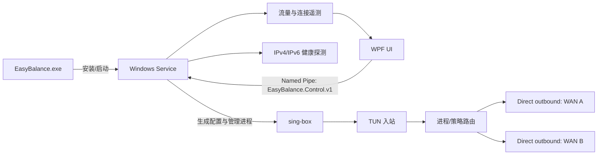

# EasyNetBalance

[English](README.md)

EasyNetBalance 是一个面向 Windows 的多 WAN 网络路由管理器。它把不同应用的流量按规则送到指定网卡，并在网卡故障时把后续新连接切换到备用出口。项目把 sing-box 作为数据平面，由 EasyNetBalance Service 负责配置、健康检查、故障转移和运行状态采集。

它适合需要同时使用有线、Wi-Fi、蜂窝网络或 VPN 虚拟网卡的场景，例如：

- 让浏览器、下载器或指定程序固定走某个出口；
- 两个 WAN 按实际流量字节比例分担新连接；
- 某个出口的 IPv4 或 IPv6 不可用时独立切换；
- 在界面查看每个出口的流量、活动连接、进程和目标 IP。

EasyNetBalance 不会把两条线路合并成一条连接的带宽，也不会迁移已经建立的 TCP 连接。负载比例只影响后续新连接。

## 快速开始

### 使用发布包

从 [GitHub Releases](https://github.com/jung233/EasyNetBalance/releases) 下载 Windows x64 ZIP，解压后只需运行：

```text
EasyBalance.exe
```

这是唯一的用户入口。首次启动会请求管理员权限，将 Service 和随包提供的 sing-box 安装到受保护目录，注册并启动 `EasyBalance` Windows Service，然后打开管理界面。之后再次双击同一个 EXE 即可打开 UI；关闭 UI 不会停止路由服务。

发布包已经包含经过许可审查的官方 sing-box Windows 二进制，不需要用户另行下载核心。每个发布包都带有 `THIRD_PARTY_NOTICES.md`、`SING-BOX-SOURCE.txt` 和对应的上游许可证信息，详情见 [第三方声明](THIRD_PARTY_NOTICES.md)。

### 第一次配置

1. 在 **Interfaces** 中确认要使用的网卡，并关闭不希望参与路由的虚拟网卡。
2. 在 **Failover / Policies** 中创建策略，选择主网卡和备用网卡。
3. 如果要使用双 WAN，打开流量负载并拖动比例滑杆。例如 `70% / 30%` 表示后续新连接以实际转发字节为目标，逐步接近该比例。
4. 在 **Application rules** 中按进程路径或进程名添加规则，并选择策略。完整 EXE 路径优先于同名进程。
5. 点击 **Enable routing**，然后在 Dashboard、Interfaces 和 Live monitor 中确认状态。

比例改变后不会重启 sing-box，也不会强行移动已有连接。某个出口不可用时，服务会暂时把新连接交给健康出口；恢复后再逐步回到设定比例。

## 界面功能

- **Dashboard**：服务、sing-box 核心、策略和网卡的总览。
- **Application rules**：维护进程到策略的映射。
- **Interfaces**：查看网卡、IPv4/IPv6 健康状态、网关、延迟和最近探测时间。
- **Failover / Policies**：设置主备关系、自动回切和双 WAN 字节比例。
- **Live monitor**：按出口显示实时上传/下载速率、累计字节和活动连接；连接行可显示进程、目标 IP、实际出口和预计出口。
- **Logs**：查看 Service、sing-box 和故障转移事件。
- **Diagnostics**：校验生成配置、查看计数器并导出诊断 ZIP。导出时可以遮盖 IP 地址。

监控数据来自 Service 的采样和 sing-box 控制接口。短于采样周期的连接可能不会出现在累计流量中；如果核心没有提供足够的进程或出口信息，界面会显示 `Unknown`，不会猜测。

## 工作原理



### 组件职责

| 组件 | 职责 |
| --- | --- |
| `EasyBalance.exe`（UI） | 单 EXE 入口、首次安装/更新、WPF 管理界面；不直接启动 sing-box。 |
| `EasyBalance.Service` | Windows Service；保存设置、探测网卡、生成配置、启动/停止核心、执行故障转移和提供遥测。 |
| `sing-box` | TUN、DNS/路由规则和实际网络转发的数据平面。 |
| `EasyBalance.Shared` | UI 与 Service 共用的设置模型、策略模型、规则模型和 IPC DTO。 |
| Named Pipe | UI 与 Service 的本机控制通道；请求和响应均为单行 JSON。 |

Service 为每个策略和地址族生成独立 selector，并把 `process_path` / `process_name` 规则写入 sing-box 配置。网卡使用 Windows 的持久接口 GUID 保存；只有在生成配置时才把当前网卡名称解析为 `bind_interface`，因此网卡名称变化不会改变策略归属。

双 WAN 模式会在 Service 内启动仅监听 loopback 的 SOCKS5 分配层。它按两个出口已经转发的上传和下载字节计算偏差，为新连接选择需要补偿的一侧，再让 sing-box 将连接绑定到对应物理网卡。控制 API 和该分配层都只监听 `127.0.0.1`，并使用随机凭据。

## 数据位置与维护

| 位置 | 内容 |
| --- | --- |
| `%ProgramData%\\EasyBalance\\settings.json` | 设置、策略和应用规则。 |
| `%ProgramData%\\EasyBalance\\generated\\sing-box.json` | 当前生成的配置；诊断界面会遮盖 secret 和代理密码。 |
| `%ProgramData%\\EasyBalance\\logs\\` | Service 日志。 |
| `%LocalAppData%\\EasyBalance\\logs\\ui-startup.log` | UI 安装、更新和启动失败日志。 |
| `%ProgramFiles%\\EasyBalance\\` | 受保护的 Service 和 sing-box 安装目录。 |

卸载时，在管理员 PowerShell 中停止并删除服务，再删除安装目录和 `%ProgramData%\\EasyBalance`：

```powershell
sc.exe stop EasyBalance
sc.exe delete EasyBalance
```

如果 sing-box 报告安装目录可被普通用户写入、替换或目录所有者不受信任，请保留安装目录的默认管理员/SYSTEM 权限，不要把核心放在 Downloads、桌面或用户可写目录中。

## 从源码构建

开发环境需要 Windows 10/11 和 .NET 8 SDK。发布包由 GitHub Actions 在 Windows runner 上生成；仓库的发布工作流会编译 Service 和 UI，把官方 sing-box 核心放入单 EXE，并创建预览 Release。

```powershell
dotnet restore .\\EasyBalance.sln
dotnet build .\\EasyBalance.sln -c Release
```

自行运行源码版本时，可以分别启动 Service 和 UI。Service 支持 `--console` 作为前台调试入口：

```powershell
.\\src\\EasyBalance.Service\\bin\\Release\\net8.0-windows\\EasyBalance.Service.exe --console
.\\src\\EasyBalance.UI\\bin\\Release\\net8.0-windows\\EasyBalance.UI.exe
```

源码运行需要兼容的 `sing-box.exe`。可以把它放在 Service 可执行文件旁的 `core\\sing-box.exe`，或在 Service 设置中指定管理员保护目录下的完整路径。核心必须支持项目使用的 TUN、路由和 Clash API 能力；Service 启动前会运行 `sing-box version` 检查能力。

## UI 与 Service 对接

从零重写 UI 时，请以 [UI_SERVICE_CONTRACT.md](docs/UI_SERVICE_CONTRACT.md) 为准。文档定义了：

- Named Pipe 名称、请求/响应格式和错误处理；
- 状态、网卡、规则、日志、诊断和连接遥测接口；
- `SetTrafficRatio` 的滑杆调用约定；
- 单 EXE 安装、更新和敏感信息处理要求。

UI 每约 2 秒轮询一次连接遥测，离开监控页后应停止轮询。写设置失败时必须显示 Service 返回的错误，并重新读取状态和日志，避免显示过期数据。

## 故障排查

1. **Service unavailable**：以管理员身份启动入口，检查 `EasyBalance` 服务状态和 `%LocalAppData%\\EasyBalance\\logs\\ui-startup.log`。
2. **sing-box core faulted**：先查看 `%ProgramData%\\EasyBalance\\logs\\`，确认核心路径、文件权限、TUN 驱动和核心能力标记。
3. **invalid IP address**：检查每个策略的网关、DNS、探测地址和保存的网卡地址；IPv4 与 IPv6 配置分别检查。
4. **路由不通或出现环路**：确认每个 direct outbound 的 `bind_interface` 对应当前物理网卡；VPN、Hyper-V、WSL、Docker 共存时可暂时关闭 `strict_route` 排查冲突。
5. **只有一条线路工作**：确认两张网卡都允许使用且 IPv4/IPv6 健康，双 WAN 策略已选择两个不同的接口。比例只作用于新连接。

EasyNetBalance 不提供已有连接的无缝迁移、单流带宽叠加、MPTCP 或包级多路径聚合。真实 TUN、DNS、IPv6、睡眠唤醒以及与其他 VPN 共存情况，应在目标 Windows 环境中验证。

## 许可

EasyNetBalance 是独立的控制应用。发布包中包含未修改的 sing-box Windows 二进制；sing-box 按 GPL-3.0-or-later 许可发布。再分发包含 sing-box 的包时，请保留版权和许可声明，并按 GPL 条款提供对应源代码。具体归属和源码地址见 [THIRD_PARTY_NOTICES.md](THIRD_PARTY_NOTICES.md)。
